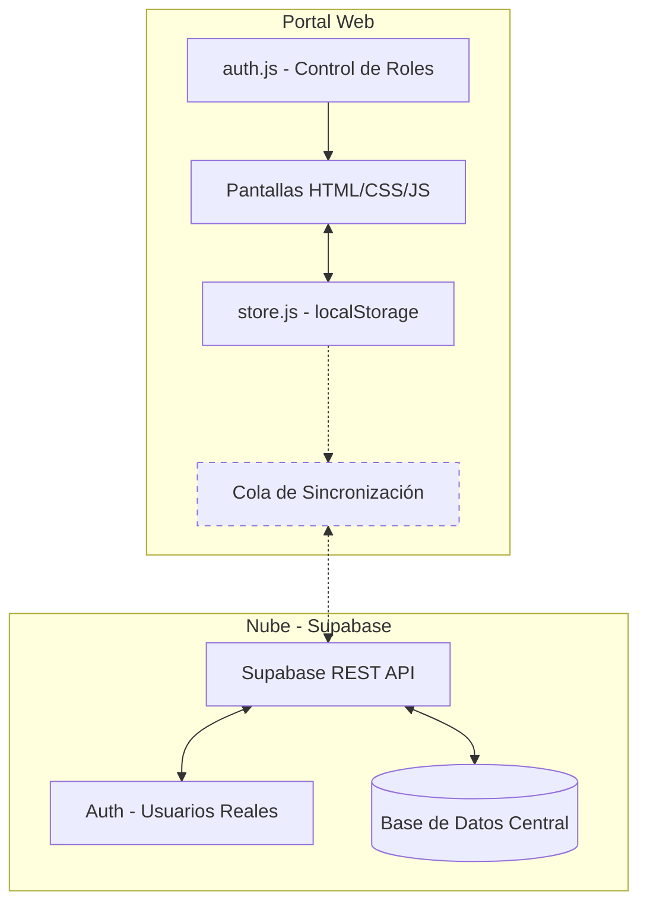

# Arquitectura del Sistema — JAAR Digital

## 1. Visión General

La solución está construida bajo una arquitectura **"Offline-First" (Primero Local)**. Es una PWA (Aplicación Web Progresiva) en HTML5 + CSS3 + JavaScript Vainilla, diseñada para funcionar sin internet y sincronizarse con **Supabase** cuando hay conexión.

---

## 2. Stack Tecnológico

| Capa | Tecnología | Propósito |
|---|---|---|
| **Frontend** | HTML5 + CSS3 + JavaScript Vainilla | Interfaz de usuario. Sin frameworks, máxima portabilidad. |
| **Persistencia Local** | `localStorage` del navegador | Fuente de verdad local cuando no hay internet. |
| **Exportación Excel** | SheetJS (xlsx.js, incluido localmente) | Generación de archivos `.xlsx` sin servidor. |
| **PWA** | `manifest.json` | Instalable en pantalla de inicio del celular. |
| **Backend (futuro)** | Supabase (PostgreSQL + Auth) | Sincronización, autenticación real y reportes centralizados. |

---

## 3. Diagrama de Arquitectura



---

## 4. Estrategia de Sincronización

1. **Escritura local:** Toda acción se guarda en `localStorage` inmediatamente.
2. **Cola de sincronización:** Los registros se marcan como `pendiente`.
3. **Detección de red:** El código escucha eventos `online`/`offline` del navegador.
4. **Push a Supabase:** Al recuperar conexión, los datos pendientes se envían.
5. **Confirmación:** Los registros se marcan como `sincronizado`.

---

## 5. Sistema de Roles (RBAC)

```
┌─────────────┬────────────────────────────────────────────────────┐
│ Rol         │ Acceso a Pantallas                                 │
├─────────────┼────────────────────────────────────────────────────┤
│ admin       │ admin.html (gestión de usuarios)                   │
│ cobrador    │ index, jornales, gastos, foro, reporte             │
│ minsa       │ reporte.html (solo lectura y descarga)             │
│ cliente     │ historial.html, foro.html (solo lectura)           │
└─────────────┴────────────────────────────────────────────────────┘
```

---

## 6. Modelo de Datos (localStorage)

| Clave | Contenido |
|---|---|
| `jaar_usuarios` | Lista de usuarios registrados con estado (pendiente/activo) |
| `jaar_miembros` | Vecinos de la comunidad (nombre, casa, estado de pago) |
| `jaar_pagos` | Cobros registrados offline |
| `jaar_jornales` | Registro de jornadas de trabajo comunitario |
| `jaar_gastos` | Egresos y compras de la junta |
| `jaar_foros` | Avisos y anuncios del tablón comunitario |
| `jaar_role` | Rol del usuario con sesión activa |
