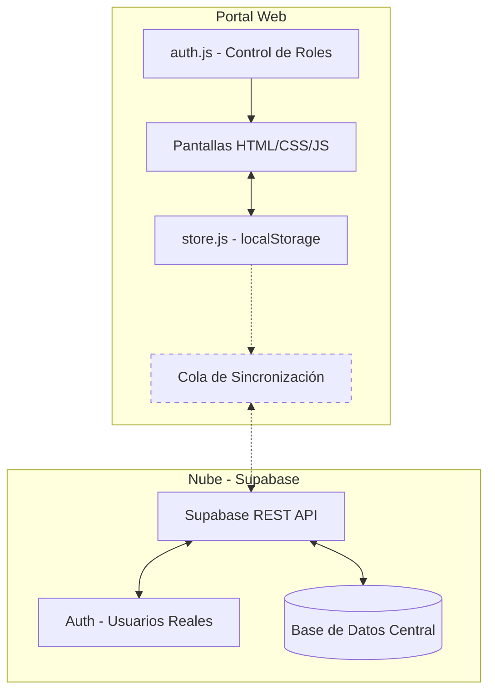

# Arquitectura del Sistema — JAAR Digital

## 1. Visión General

La solución está construida bajo una arquitectura **"Offline-First" (Primero Local)**. Es una PWA (Aplicación Web Progresiva) en HTML5 + CSS3 + JavaScript Vainilla, diseñada para funcionar sin internet y sincronizarse con **Supabase** cuando hay conexión.

---

## 2. Stack Tecnológico

| Capa | Tecnología | Propósito |
|---|---|---|
| **Frontend** | HTML5 + CSS3 + JavaScript Vainilla | Interfaz de usuario. Sin frameworks, máxima portabilidad. |
| **Persistencia Local** | `localStorage` del navegador | Fuente de verdad local cuando no hay internet. |
| **Exportación Excel** | SheetJS (xlsx.js, incluido localmente) | Generación de archivos `.xlsx` sin servidor. |
| **PWA** | `manifest.json` | Instalable en pantalla de inicio del celular. |
| **Backend (futuro)** | Supabase (PostgreSQL + Auth) | Sincronización, autenticación real y reportes centralizados. |

---

## 3. Diagrama de Arquitectura



---

## 4. Estrategia de Sincronización

1. **Escritura local:** Toda acción se guarda en `localStorage` inmediatamente.
2. **Cola de sincronización:** Los registros se marcan como `pendiente`.
3. **Detección de red:** El código escucha eventos `online`/`offline` del navegador.
4. **Push a Supabase:** Al recuperar conexión, los datos pendientes se envían.
5. **Confirmación:** Los registros se marcan como `sincronizado`.

---

## 5. Sistema de Roles (RBAC)

```
┌─────────────┬────────────────────────────────────────────────────┐
│ Rol         │ Acceso a Pantallas                                 │
├─────────────┼────────────────────────────────────────────────────┤
│ admin       │ admin.html (gestión de usuarios)                   │
│ cobrador    │ index, jornales, gastos, foro, reporte             │
│ minsa       │ reporte.html (solo lectura y descarga)             │
│ cliente     │ historial.html, foro.html (solo lectura)           │
└─────────────┴────────────────────────────────────────────────────┘
```

---

## 6. Modelo de Datos (localStorage)

| Clave | Contenido |
|---|---|
| `jaar_usuarios` | Lista de usuarios registrados con estado (pendiente/activo) |
| `jaar_miembros` | Vecinos de la comunidad (nombre, casa, estado de pago) |
| `jaar_pagos` | Cobros registrados con tipo, monto, mes target y cobrador |
| `jaar_saldos` | Libro mayor de saldos por usuario/mes (`userId_YYYY-MM`) |
| `jaar_config` | Configuración del sistema (cuotaMensual, permitirParciales, mesesGraciaCorte) |
| `jaar_jornales` | Registro de jornadas de trabajo comunitario |
| `jaar_gastos` | Egresos y compras de la junta |
| `jaar_foros` | Avisos y anuncios del tablón comunitario |
| `jaar_role` | Rol del usuario con sesión activa |
| `jaar_comisiones` | Registro de comisiones por cobro (split devs/cobrador) |
| `jaar_cobrador_balance` | Balance acumulado del cobrador |
| `jaar_config_comisiones` | Configuración de splits y apartados de comisión |
| `jaar_puntos` | Puntos acumulados por vecino |
| `jaar_canjes` | Historial de canjes de puntos por descuento |
| `jaar_saldos_puntos` | Saldo actual de puntos por usuario |
| `jaar_config_puntos` | Reglas y tasas del sistema de puntos |
| `jaar_ai_cache` | Caché de resultados del motor IA (TTL: 1 hora) |
| `jaar_ai_config` | Configuración del motor de inteligencia artificial |

---

## 7. Módulos de Negocio

| Módulo | Archivo | Responsabilidad |
|--------|---------|-----------------|
| **Motor de Pagos** | `js/pagos.js` | `PagosEngine`: registrar pagos (mensual, diario, multi-mes, parcial, adelanto, puesta al día), calcular estados y deuda, migrar datos legacy |
| **Motor de Comisiones** | `js/comisiones.js` | `Comisiones`: calcular y registrar el split cobrador/devs (40/60) por cada cobro, consultar acumulados |
| **Motor de Puntos** | `js/puntos.js` | `Puntos`: otorgar puntos por pagos y jornales, canjear por descuento (1 pt = B/.0.10, min 10, max B/.1.50/mes), verificar bonos trimestrales y anuales |
| **Motor de IA** | `js/ai-engine.js` | `AIEngine`: calcular puntaje de riesgo por hogar (0-100), predecir morosidad (fórmula compuesta con 5 factores), generar cola de cobranza inteligente, detectar anomalías con Z-score |
| **UI de IA** | `js/ai-insights.js` | `AIInsights`: renderizar panel de KPIs, badges de riesgo, heatmap de sectores, mensajes amigables de riesgo para clientes |
| **Persistencia** | `js/store.js` | Accessors centralizados para todas las claves de `localStorage` |
| **Autenticación** | `js/auth.js` | RBAC: guardias de rutas por rol, renderizado de navegación |
| **Reportes** | `js/reporte.js` | Generación de reporte financiero y exportación Excel (8 hojas: Ingresos, Egresos, Jornales, Resumen, Detalle Cobros, Estado Cuentas, Comisiones, Análisis IA) |
