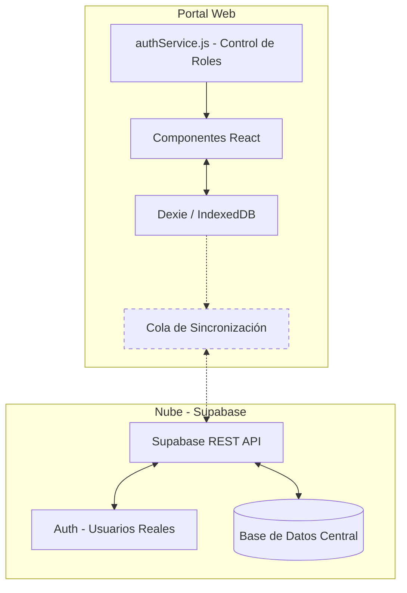

# Arquitectura del Sistema — SIMAP Digital

## 1. Visión General

La solución está construida bajo una arquitectura **"Offline-First" (Primero Local)**. Es una PWA (Aplicación Web Progresiva) en HTML5 + CSS3 + JavaScript Vainilla, diseñada para funcionar sin internet y sincronizarse con **Supabase** cuando hay conexión.

---

## 2. Stack Tecnológico

| Capa | Tecnología | Propósito |
|---|---|---|
| **Frontend** | React 19 + Vite + React Router | Interfaz de usuario. SPA moderna con componentes modulares. |
| **Persistencia Local** | `IndexedDB` (via `Dexie.js`) | Fuente de verdad local cuando no hay internet, mayor capacidad y rendimiento. |
| **Exportación Excel** | SheetJS (xlsx.js, incluido localmente) | Generación de archivos `.xlsx` sin servidor. |
| **PWA** | `manifest.json` | Instalable en pantalla de inicio del celular. |
| **Backend (futuro)** | Supabase (PostgreSQL + Auth) | Sincronización, autenticación real y reportes centralizados. |

---

## 3. Diagrama de Arquitectura



---

## 4. Estrategia de Sincronización

1. **Escritura local:** Toda acción se guarda en `IndexedDB` inmediatamente a través de Dexie.
2. **Cola de sincronización:** Los registros se marcan como `pendiente`.
3. **Detección de red:** El código escucha eventos `online`/`offline` del navegador.
4. **Push a Supabase:** Al recuperar conexión, los datos pendientes se envían.
5. **Confirmación:** Los registros se marcan como `sincronizado`.

---

## 5. Sistema de Roles (RBAC)

```
┌─────────────┬────────────────────────────────────────────────────┐
│ Rol         │ Acceso a Pantallas                                 │
├─────────────┼────────────────────────────────────────────────────┤
│ admin       │ /admin (gestión de usuarios)                       │
│ cobrador    │ /, /jornales, /gastos, /foro, /reporte             │
│ minsa       │ /reporte (solo lectura y descarga)                 │
│ cliente     │ /historial, /foro (solo lectura)                   │
└─────────────┴────────────────────────────────────────────────────┘
```

---

## 6. Modelo de Datos (IndexedDB / Dexie)

| Clave | Contenido |
|---|---|
| `simap_usuarios` | Lista de usuarios registrados con estado (pendiente/activo) |
| `simap_miembros` | Vecinos de la comunidad (nombre, casa, estado de pago) |
| `simap_pagos` | Cobros registrados con tipo, monto, mes target y cobrador |
| `simap_saldos` | Libro mayor de saldos por usuario/mes (`userId_YYYY-MM`) |
| `simap_config` | Configuración del sistema (cuotaMensual, permitirParciales, mesesGraciaCorte) |
| `simap_jornales` | Registro de jornadas de trabajo comunitario |
| `simap_gastos` | Egresos y compras de la junta |
| `simap_foros` | Avisos y anuncios del tablón comunitario |
| `simap_role` | Rol del usuario con sesión activa |
| `simap_comisiones` | Registro de comisiones por cobro (split devs/cobrador) |
| `simap_cobrador_balance` | Balance acumulado del cobrador |
| `simap_config_comisiones` | Configuración de splits y apartados de comisión |
| `simap_puntos` | Puntos acumulados por vecino |
| `simap_canjes` | Historial de canjes de puntos por descuento |
| `simap_saldos_puntos` | Saldo actual de puntos por usuario |
| `simap_config_puntos` | Reglas y tasas del sistema de puntos |
| `simap_ai_cache` | Caché de resultados del motor IA (TTL: 1 hora) |
| `simap_ai_config` | Configuración del motor de inteligencia artificial |

---

## 7. Módulos de Negocio

| Módulo | Archivo | Responsabilidad |
|--------|---------|-----------------|
| **Motor de Pagos** | `src/services/pagosService.js` | Funciones para registrar pagos (mensual, diario, multi-mes, parcial, adelanto, puesta al día), calcular estados y deuda, migrar datos legacy |
| **Motor de Comisiones** | `src/services/comisionesService.js` | Calcular y registrar el split cobrador/devs (40/60) por cada cobro, consultar acumulados |
| **Motor de Puntos** | `src/services/puntosService.js` | Otorgar puntos por pagos y jornales, canjear por descuento (1 pt = B/.0.10, min 10, max B/.1.50/mes), verificar bonos trimestrales y anuales |
| **Motor de IA** | `src/services/aiService.js` | Calcular puntaje de riesgo por hogar (0-100), predecir morosidad (fórmula compuesta con 5 factores), generar cola de cobranza inteligente, detectar anomalías con Z-score |
| **UI de IA** | `src/components/AIPanel.jsx` | Renderizar panel de KPIs, badges de riesgo, heatmap de sectores, mensajes amigables de riesgo para clientes |
| **Persistencia** | `src/db/db.js` | Base de datos Dexie configurada para IndexedDB |
| **Autenticación** | `src/services/authService.js` | RBAC: guardias de rutas por rol, control de sesión en React Router |
| **Reportes** | `src/services/reportesService.js` | Generación de reporte financiero y exportación Excel (8 hojas: Ingresos, Egresos, Jornales, Resumen, Detalle Cobros, Estado Cuentas, Comisiones, Análisis IA) |
