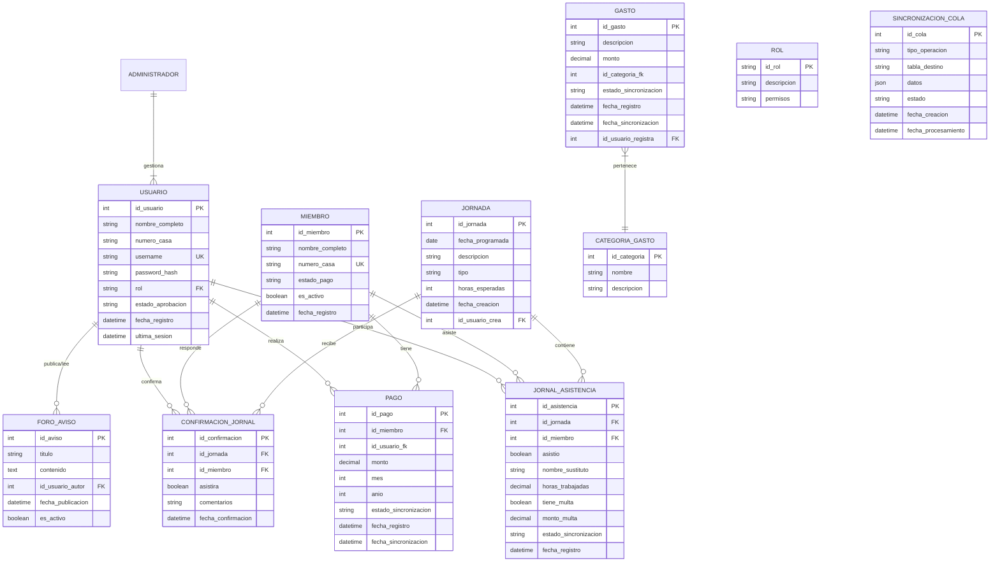
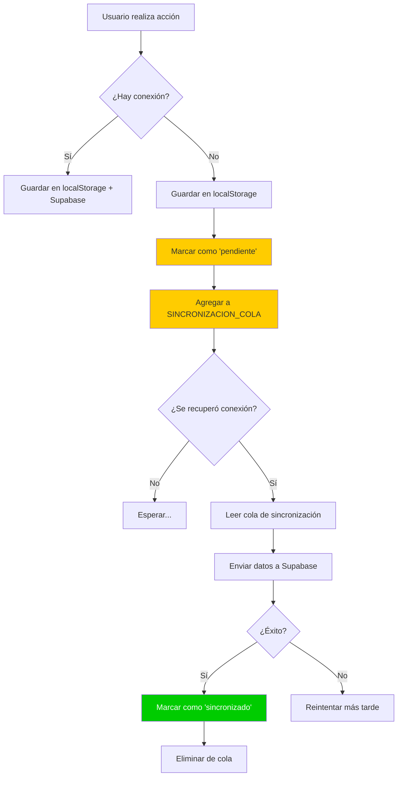

# Diagrama Entidad-Relación (E/R) - JAAR Digital

## 1. Requerimientos Funcionales Derivados

A partir de los RF originales, se derivan las siguientes funcionalidades específicas para el modelo de datos:

### RF-01: Gestión de Usuarios
- **RF-01.1**: El sistema debe permitir registrar usuarios con nombre completo, número de casa, nombre de usuario y contraseña.
- **RF-01.2**: El sistema debe almacenar el estado de aprobación del usuario (pendiente/aprobado/suspendido).
- **RF-01.3**: El sistema debe asignar un rol a cada usuario (Administrador, Cobrador, Inspector MINSA, Cliente).
- **RF-01.4**: El administrador debe poder aprobar, suspender o resetear contraseñas de usuarios.

### RF-02: Registro de Cobros
- **RF-02.1**: El sistema debe registrar pagos de cuotas mensuales ($3.00) por vecino.
- **RF-02.2**: El sistema debe almacenar el mes y año del pago realizado.
- **RF-02.3**: El sistema debe indicar el estado de sincronización de cada pago (pendiente/sincronizado).
- **RF-02.4**: El sistema debe permitir filtrar vecinos por mes y estado de pago.
- **RF-02.5**: El sistema debe calcular y mostrar el estado del vecino: Activo/Al Día, Moroso (1-2 meses), Para Corte (3+ meses).

### RF-03: Control de Caja y Gastos
- **RF-03.1**: El sistema debe registrar egresos con descripción, monto y fecha.
- **RF-03.2**: El sistema debe clasificar los gastos por categoría (opcional).
- **RF-03.3**: El sistema debe mantener un historial de todos los gastos registrados.

### RF-04: Control de Jornales
- **RF-04.1**: El sistema debe registrar la asistencia de miembros a jornadas de trabajo.
- **RF-04.2**: El sistema debe permitir registrar sustitutos con nombre completo.
- **RF-04.3**: El sistema debe registrar las horas trabajadas por cada miembro o sustituto.
- **RF-04.4**: El sistema debe registrar multas por inasistencia ($15.00 por defecto).
- **RF-04.5**: El sistema debe permitir a los clientes confirmar asistencia a jornales programados.

### RF-05: Foro de Avisos
- **RF-05.1**: El sistema debe permitir publicar avisos con título, contenido y fecha.
- **RF-05.2**: Solo Cobrador puede crear avisos.
- **RF-05.3**: Todos los usuarios autenticados pueden leer los avisos.

### RF-06: Historial del Cliente
- **RF-06.1**: El sistema debe mostrar al cliente su historial personal de pagos.
- **RF-06.2**: El sistema debe mostrar las horas trabajadas por el cliente.
- **RF-06.3**: El cliente no debe poder ver información de otros vecinos.

### RF-07: Reportes MINSA
- **RF-07.1**: El sistema debe generar reportes filtrables por rango de fechas.
- **RF-07.2**: El sistema debe permitir seleccionar tipos de reporte: Ingresos, Egresos, Jornales.
- **RF-07.3**: El sistema debe exportar reportes a PDF y Excel (.xlsx).
- **RF-07.4**: El inspector MINSA solo tiene acceso de lectura a los reportes.

### RF-08: Sincronización Automática
- **RF-08.1**: El sistema debe almacenar datos localmente cuando no hay conexión.
- **RF-08.2**: El sistema debe detectar automáticamente cuando se recupera la conexión.
- **RF-08.3**: El sistema debe enviar automáticamente los datos pendientes a Supabase.
- **RF-08.4**: El sistema debe actualizar el estado de sincronización de cada registro.

### RF-09: Filtros en Cobros
- **RF-09.1**: El sistema debe permitir filtrar la lista de vecinos por mes (enero-diciembre).
- **RF-09.2**: El sistema debe permitir filtrar por estado de pago (al día, moroso, para corte).

### RF-10: Estados de Pago
- **RF-10.1**: El sistema debe calcular automáticamente el estado de cada vecino basado en meses sin pagar.
- **RF-10.2**: El sistema debe mostrar visualmente el estado con indicadores de color.
- **RF-10.3**: El sistema debe identificar: Activo/Al Día, Moroso (1-2 meses), Para Corte (3+ meses).

### RF-11: Confirmación de Jornal
- **RF-11.1**: El sistema debe mostrar los jornales programados a los clientes.
- **RF-11.2**: El cliente debe poder aceptar o rechazar asistencia o informar de un sustituto para un jornal.
- **RF-11.3**: El sistema debe registrar la respuesta del cliente con fecha y hora.

---

## 2. Requerimientos NO Funcionales Derivados

### RNF-01: Disponibilidad Offline
- **RNF-01.1**: La aplicación debe funcionar completamente sin conexión a internet.
- **RNF-01.2**: Todas las operaciones de cobro, jornales y gastos deben estar disponibles offline.
- **RNF-01.3**: La aplicación debe almacenar localmente todos los datos generados offline.

### RNF-02: Portabilidad
- **RNF-02.1**: La aplicación debe ser compatible con navegadores modernos (Chrome, Firefox, Safari, Edge).
- **RNF-02.2**: La aplicación debe ser responsive y funcionar en dispositivos móviles y desktop.
- **RNF-02.3**: No debe requerir instalación de software adicional.

### RNF-03: Seguridad
- **RNF-03.1**: El sistema debe proteger las rutas según el rol del usuario.
- **RNF-03.2**: El sistema debe redirigir automáticamente si un usuario intenta acceder a una ruta no autorizada.
- **RNF-03.3**: Las contraseñas deben almacenarse de forma segura (hash).
- **RNF-03.4**: La sesión del usuario debe tener un tiempo de expiración.

### RNF-04: Privacidad
- **RNF-04.1**: Cada cliente solo debe poder ver su propia información.
- **RNF-04.2**: Los datos personales de los vecinos deben estar protegidos.
- **RNF-04.3**: El historial de pagos es confidencial por usuario.

### RNF-05: Exportación
- **RNF-05.1**: Los reportes deben poder exportarse a Excel (.xlsx) sin conexión.
- **RNF-05.2**: Los reportes deben poder exportarse a PDF sin conexión.
- **RNF-05.3**: La exportación debe mantener el formato y los filtros aplicados.

### RNF-06: Rendimiento
- **RNF-06.1**: El tiempo de carga inicial de la aplicación no debe exceder 3 segundos.
- **RNF-06.2**: Las operaciones locales (CRUD) deben ejecutarse en menos de 500ms.
- **RNF-06.3**: La sincronización no debe bloquear la interfaz de usuario.

### RNF-07: Escalabilidad
- **RNF-07.1**: El sistema debe soportar hasta 500 vecinos registrados.
- **RNF-07.2**: El localStorage debe manejar hasta 10,000 registros sin degradación.

### RNF-08: Usabilidad
- **RNF-08.1**: La interfaz debe ser intuitiva para usuarios con poca experiencia técnica.
- **RNF-08.2**: Los indicadores de estado (online/offline) deben ser claramente visibles.
- **RNF-08.3**: Las acciones críticas (pagos, gastos) deben tener confirmación.

---

## 3. Diagrama Entidad-Relación (E/R)

### 3.1 Entidades Principales

### 3.2 Descripción de Entidades

| Entidad | Descripción | Atributos Clave |
|---------|-------------|-----------------|
| **USUARIO** | Usuarios del sistema con credenciales de acceso | id_usuario, username, rol, estado_aprobacion |
| **MIEMBRO** | Vecinos de la comunidad (puede coincidir con USUARIO) | id_miembro, numero_casa, estado_pago |
| **PAGO** | Registros de cobros de cuotas mensuales | id_pago, id_miembro, monto, mes, anio |
| **JORNADA** | Jornadas de trabajo comunitario programadas | id_jornada, fecha_programada, descripcion |
| **JORNAL_ASISTENCIA** | Registro de asistencia a jornadas por miembro | id_asistencia, id_jornada, id_miembro, asistio |
| **CONFIRMACION_JORNAL** | Confirmaciones de asistencia de clientes a jornadas | id_confirmacion, id_jornada, id_miembro, asistira |
| **GASTO** | Egresos registrados de la junta | id_gasto, descripcion, monto, fecha |
| **CATEGORIA_GASTO** | Categorías para clasificar gastos | id_categoria, nombre |
| **FORO_AVISO** | Avisos publicados en el foro comunitario | id_aviso, titulo, contenido, fecha_publicacion |
| **ROL** | Roles del sistema (RBAC) | id_rol, descripcion, permisos |
| **SINCRONIZACION_COLA** | Cola de operaciones pendientes de sincronizar | id_cola, tipo_operacion, datos, estado |

### 3.3 Relaciones y Cardinalidades

| Relación | Tipo | Descripción |
|----------|------|-------------|
| USUARIO - PAGO | 1:N | Un usuario puede registrar múltiples pagos |
| MIEMBRO - PAGO | 1:N | Un miembro tiene múltiples pagos registrados |
| USUARIO - JORNAL_ASISTENCIA | 1:N | Un usuario puede registrar múltiples asistencias |
| MIEMBRO - JORNAL_ASISTENCIA | 1:N | Un miembro tiene múltiples registros de asistencia |
| JORNADA - JORNAL_ASISTENCIA | 1:N | Una jornada tiene múltiples asistencias registradas |
| JORNADA - CONFIRMACION_JORNAL | 1:N | Una jornada recibe múltiples confirmaciones |
| MIEMBRO - CONFIRMACION_JORNAL | 1:N | Un miembro puede confirmar múltiples jornadas |
| ADMINISTRADOR - USUARIO | 1:N | Un administrador gestiona múltiples usuarios |
| GASTO - CATEGORIA_GASTO | N:1 | Múltiples gastos pertenecen a una categoría |
| USUARIO - FORO_AVISO | 1:N | Un usuario puede publicar múltiples avisos |

### 3.4 Reglas de Negocio Implementadas en el Modelo

1. **Estado de Pago del Miembro**: Se calcula automáticamente basado en los pagos registrados en los últimos 3 meses.
   - **Activo/Al Día**: Pagó el mes actual y los 2 anteriores.
   - **Moroso**: Debe 1 o 2 meses.
   - **Para Corte**: Debe 3 o más meses consecutivos.

2. **Multas por Inasistencia**: Si `asistio = false` en JORNAL_ASISTENCIA, se aplica multa automática de $15.00.

3. **Sustitutos en Jornales**: Si un miembro manda sustituto, `asistio = true` pero se registra `nombre_sustituto`.

4. **Sincronización**: Todas las entidades operativas (PAGO, JORNAL_ASISTENCIA, GASTO) tienen `estado_sincronizacion` para control offline/online.

5. **Privacidad por Rol**: 
   - CLIENTE: Solo ve sus propios registros (PAGO, JORNAL_ASISTENCIA, CONFIRMACION_JORNAL).
   - COBRADOR/ADMIN: Ven todos los registros.
   - MINSA: Solo lectura de reportes agregados.

---

## 4. Diagrama de Flujo de Sincronización

---

## 5. Consideraciones de Implementación

### 5.1 Índices Recomendados
- `PAGO(id_miembro, anio, mes)` - Para consultas de historial por período.
- `JORNAL_ASISTENCIA(id_jornada, id_miembro)` - Para verificar asistencia única.
- `USUARIO(username)` - Búsqueda rápida en login.
- `SINCRONIZACION_COLA(estado, fecha_creacion)` - Para procesar cola eficientemente.

### 5.2 Vistas Sugeridas (Supabase/PostgreSQL)
- `vista_estado_miembros`: Calcula estado actual (Activo/Moroso/Para Corte).
- `vista_reporte_trimestral`: Agrega ingresos, egresos y jornales por trimestre.
- `vista_horas_donadas`: Suma horas trabajadas por miembro.

### 5.3 Triggers Automatizados
- Actualizar `estado_pago` en MIEMBRO después de INSERT/UPDATE en PAGO.
- Registrar en bitácora cuando se cambia estado de aprobación de USUARIO.
- Validar que no existan pagos duplicados (mismo miembro, mismo mes/año).

---

*Documento generado para el proyecto JAAR Digital - Sistema de Gestión de Juntas de Acción Comunal*
