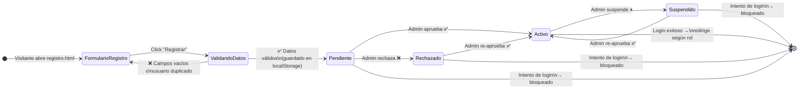
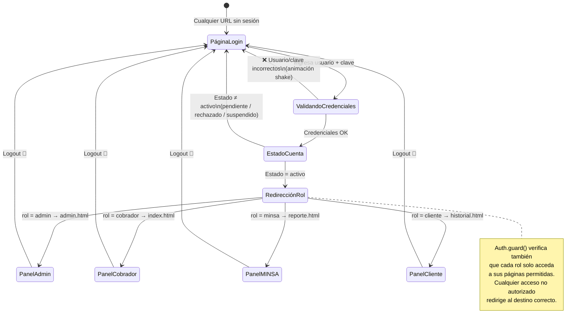
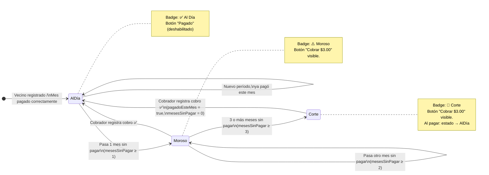
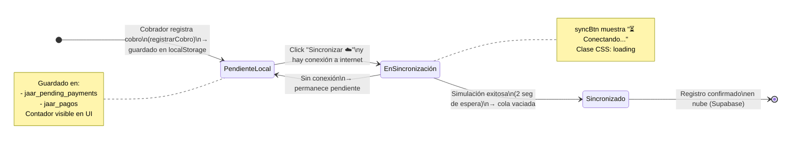
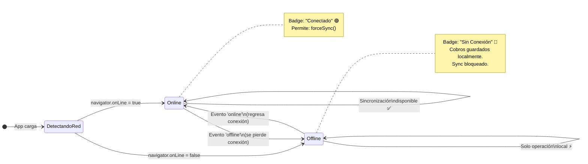
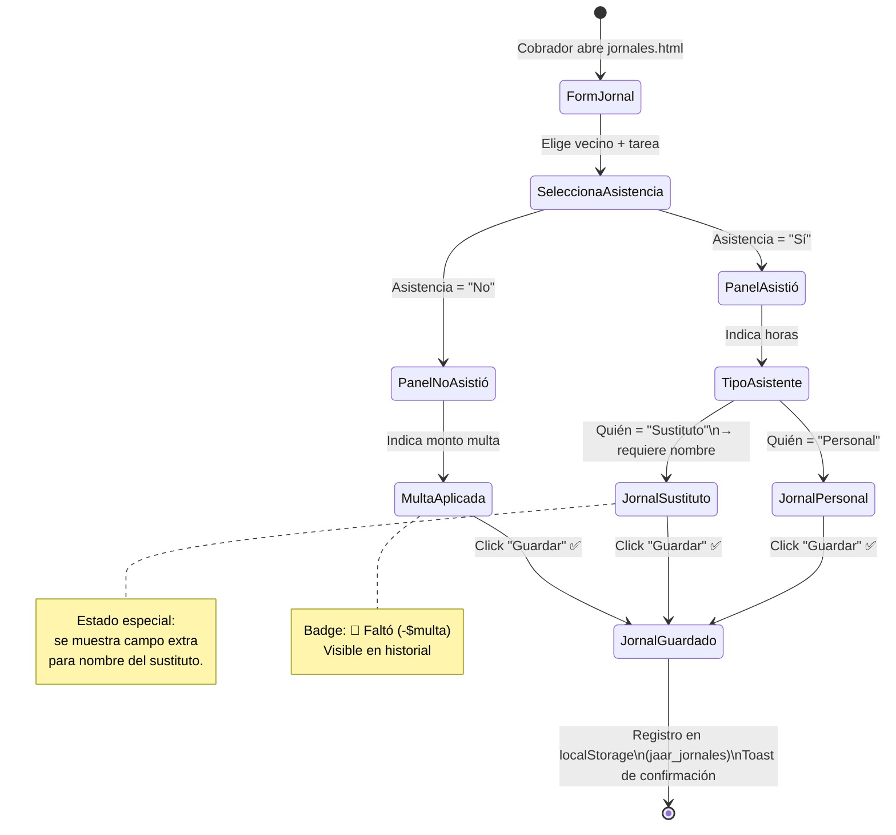
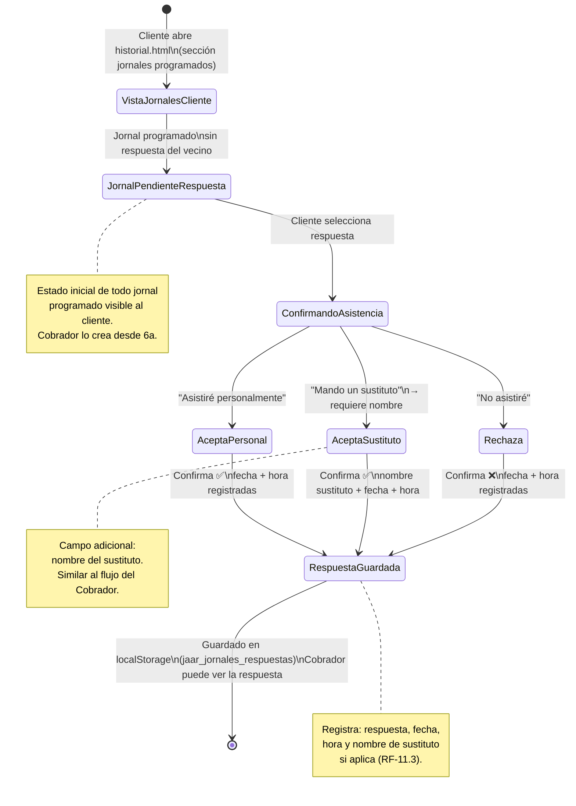
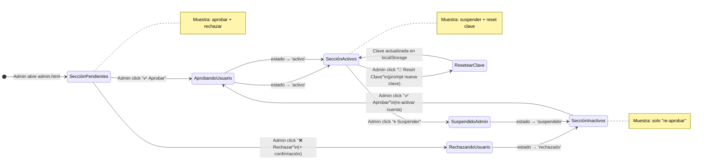
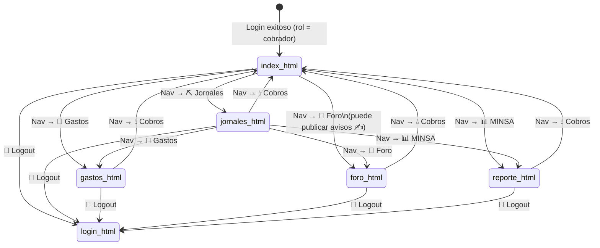
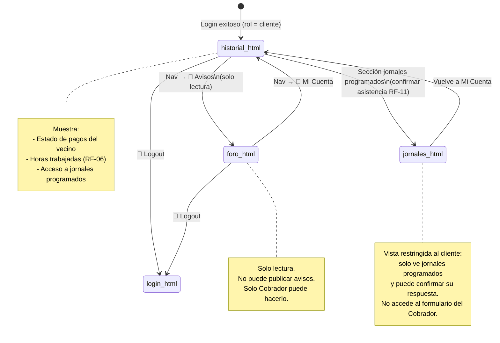

# Diagrama de Estados — JAAR Digital

Sistema de gestión comunitaria de agua potable para la Junta de Acueducto Rural y Riego (JAAR) de Caballero.

---

## 1. Estado de Cuenta de Usuario (Registro & Auth)

---

## 2. Flujo de Sesión (Login / Guard)

---

## 3. Estado de Pago de Vecino (Ciclo de Deuda)

---

## 4. Ciclo de Vida de un Cobro (Offline-First)

---

## 5. Estado de Conectividad de Red

---

## 6a. Jornal Comunitario — Registro por Cobrador

---

## 6b. Jornal Comunitario — Confirmación por Cliente (RF-11)

---

## 7. Panel de Administración — Estado de Usuarios

---

## 8a. Navegación por Módulos — Rol Cobrador

---

## 8b. Navegación por Módulos — Rol Cliente

---

## 9. Resumen de Estados Globales del Sistema

| Dominio | Estados posibles | Quién actúa |
|---|---|---|
| **Cuenta de usuario** | `pendiente` → `activo` / `rechazado` / `suspendido` | Admin |
| **Sesión** | Sin sesión → Autenticado (por rol) → Cerrada | Todos |
| **Vecino / Pago** | `Al Día` → `Moroso` → `Corte` → `Al Día` | Cobrador |
| **Cobro offline** | `registrado local` → `en sincronización` → `sincronizado` | Cobrador |
| **Red** | `online` ↔ `offline` | Sistema (automático) |
| **Jornal (registro)** | `asistió (personal/sustituto)` / `no asistió (multa)` → `guardado` | Cobrador |
| **Jornal (confirmación)** | `pendiente respuesta` → `acepta` / `sustituto` / `rechaza` → `guardado` | Cliente |
| **Foro / Aviso** | `redactado` → `publicado` (solo lectura para clientes y MINSA) | Solo Cobrador |
| **Gasto** | `registrado` → `guardado en localStorage` → `visible en reporte` | Cobrador |
| **Rol de acceso** | `admin` / `cobrador` / `minsa` / `cliente` | Sistema |

---

> **Notas de implementación:**
> - Toda la persistencia es en `localStorage` (Offline-First).
> - La sincronización con Supabase está simulada (2 seg de delay mock).
> - El guard de rutas (`Auth.guard()`) protege cada página según rol activo.
> - Los "estados" de vecinos se calculan dinámicamente (`calcularEstado()` en `app.js`), no se almacenan explícitamente.
> - **RF-05**: Solo el Cobrador puede publicar en el Foro. Admin no tiene acceso a `foro.html`.
> - **RF-06**: El historial del cliente debe mostrar horas trabajadas además del estado de pagos.
> - **RF-11**: El cliente puede confirmar asistencia, informar sustituto o rechazar un jornal programado (diagrama 6b).
