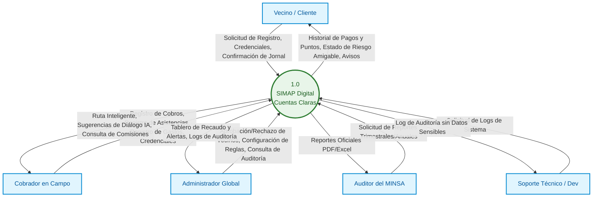
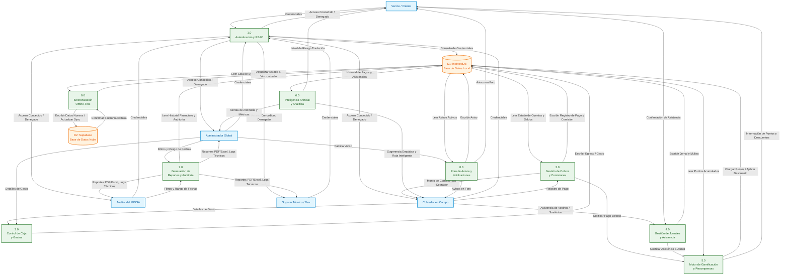
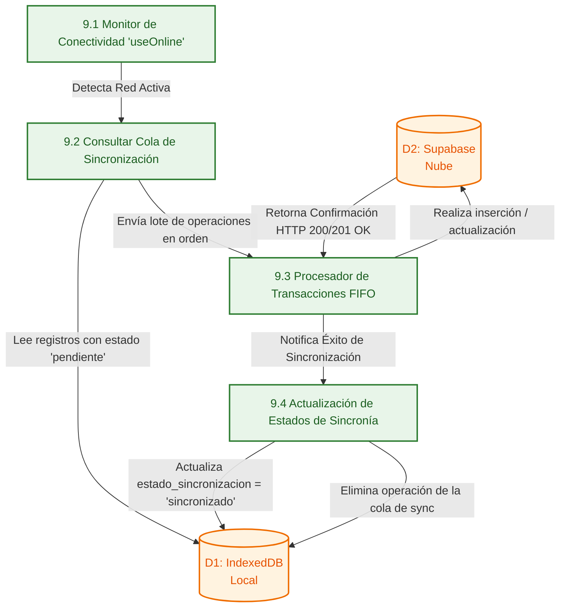

# LABORATORIO #3: DIAGRAMAS DE FLUJO DE DATOS (DFD) EN INGENIERÍA DE SOFTWARE

**UNIVERSIDAD TECNOLÓGICA DE PANAMÁ**  
**FACULTAD DE INGENIERÍA DE SISTEMAS COMPUTACIONALES**  
**DEPARTAMENTO DE SIMULACIÓN Y COMPUTACIÓN DE SISTEMAS**  

* **Asignatura:** Ingeniería de Software II  
* **Facilitador:** Ing. Jorge A. Marín  
* **Proyecto:** SIMAP Digital · Cuentas Claras 💧 (Sistema de Gestión y Fiscalización para Acueductos Rurales)  
* **Fecha:** Junio 2026  

---

## A. TÍTULO DE LA EXPERIENCIA
**DIAGRAMAS DE FLUJO DE DATOS (DFD) EN INGENIERÍA DE SOFTWARE**

---

## B. TEMAS
* Concepto y propósito de los Diagramas de Flujo de Datos (DFD).
* Simbología: procesos, flujos, entidades externas y almacenes de datos (Notación Yourdon-Coad / Gane-Sarson).
* Niveles de descomposición: Diagrama de Contexto (Nivel 0), Nivel 1 y Nivel 2.
* Reglas de balanceo y consistencia entre niveles.
* Minispecificaciones (especificación de procesos).
* Diccionario de datos.

---

## C. OBJETIVOS
* Comprender la notación estándar de los DFD y la función de cada símbolo dentro del modelado de sistemas.
* Construir diagramas de flujo de datos a partir del análisis de requerimientos del sistema **SIMAP Digital**.
* Aplicar la descomposición funcional por niveles para refinar el modelo del sistema (Contexto → Nivel 1 → Nivel 2).
* Elaborar minispecificaciones que documenten la lógica interna de cada proceso identificado.
* Construir el diccionario de datos asociado al modelo DFD, describiendo los principales flujos y almacenes.

---

## D. MARCO TEÓRICO
Un **Diagrama de Flujo de Datos (DFD)** es una representación gráfica que muestra cómo los datos se mueven a través de un sistema de información. A diferencia de los diagramas de flujo convencionales, el DFD no describe el flujo de control (decisiones, bucles), sino el flujo de información: de dónde provienen los datos, cómo se transforman y hacia dónde se dirigen.

### Simbología Estándar Utilizada
1. **Proceso (○ / ▭ Redondeado):** Representa una función o transformación que procesa datos de entrada y produce datos de salida. Se identifica con un número y un nombre en forma verbal (ej. "Validar Usuario").
2. **Flujo de Datos (→):** Indica el movimiento de datos entre procesos, entidades externas y almacenes. La punta señala la dirección del flujo y se etiqueta con el nombre del dato.
3. **Entidad Externa (□):** Actores externos al sistema (personas, organizaciones u otros sistemas) que son origen o destino de los datos. También llamados terminadores.
4. **Almacén de Datos (▭ Abierto / Cilindro):** Depósito donde los datos quedan en reposo (archivos, bases de datos, tablas). Se representa con líneas paralelas horizontales y un nombre en plural.

---

## E. DFD NIVEL 0: DIAGRAMA DE CONTEXTO
El Diagrama de Contexto define los límites de la plataforma **SIMAP Digital** y muestra las interacciones generales del sistema completo (como una sola burbuja de proceso) con las cinco entidades externas principales.



---

## F. DFD NIVEL 1: DIAGRAMA GENERAL DE PROCESOS
Este nivel desglosa el sistema en sus procesos lógicos fundamentales, especificando la interacción de cada proceso con las entidades externas y con los dos almacenes de datos: el local (`D1: IndexedDB`) y el remoto (`D2: Supabase`).



---

## G. DFD NIVEL 2: DETALLE DE PROCESOS CRÍTICOS

### 4.1 Subproceso 2.0 y 5.0: Procesamiento de Cobros, Comisiones y Puntos
Detalla la lógica interna cuando el cobrador procesa un cobro, integrando las comisiones y el motor de puntos de gamificación de forma atómica en el almacenamiento local.

```mermaid
flowchart TD
    classDef entidad fill:#e1f5fe,stroke:#0288d1,stroke-width:2px,color:#01579b;
    classDef proceso fill:#e8f5e9,stroke:#2e7d32,stroke-width:2px,color:#1b5e20;
    classDef almacen fill:#fff3e0,stroke:#ef6c00,stroke-width:2px,color:#e65100;

    C[Cobrador en Campo]:::entidad
    D1[(D1: IndexedDB)]:::almacen

    P2_1[2.1 Seleccionar Vecino y Obtener Saldos]:::proceso
    P2_2[2.2 Validar Descuento de Puntos y Canje]:::proceso
    P2_3[2.3 Registrar Pago y Aplicar Split de Comisión]:::proceso
    P5_1[5.1 Calcular y Otorgar Puntos Automáticos]:::proceso

    C -->|Selecciona Vecino| P2_1
    D1 -->|Historial de Deudas y Puntos| P2_1
    P2_1 -->|Muestra Opciones de Cobro| C

    C -->|Solicita Uso de Puntos| P2_2
    P2_2 -->|Verifica y Resta Puntos| D1
    P2_2 -->|Retorna Descuento Aplicado| P2_3

    C -->|Confirma Pago en Efectivo| P2_3
    P2_3 -->|Escribe Pago en 'simap_pagos'\n(Monto Neto + Puntos)| D1
    P2_3 -->|Calcula Split: 40% Cobrador / 60% Dev| P2_3
    P2_3 -->|Escribe Comisión en 'simap_comisiones'| D1
    P2_3 -->|Confirma Comisión Ganada| C

    P2_3 -->|Notifica Pago Exitoso| P5_1
    P5_1 -->|Valida Fecha de Pago (¿Antes del 15?)| P5_1
    P5_1 -->|Escribe Puntos Ganados\n(+2 Base, +5 Puntual, +10 Anticipado)| D1
```

### 4.2 Subproceso 9.0: Sincronización Offline-First
Detalla el flujo del motor de sincronización que asegura la consistencia entre la base de datos local y la nube (Supabase) al recuperar la conexión.



---

## H. DIAGRAMA DE FLUJO DE INTERFACES E INPUTS (NOTACIÓN DE PROCESO DE NEGOCIO Y EVENTOS)
Este diagrama representa el flujo de datos desde el punto de vista de las interfaces de usuario (UI), las entradas de datos específicas procesadas por el sistema ("Sistema"), y las salidas/eventos resultantes tanto para los flujos correctos como incorrectos (siguiendo el formato de plantilla de entrega del curso).

```mermaid
flowchart TD
    %% Estilo
    classDef ui fill:#ffffff,stroke:#0f4c81,stroke-width:2px,color:#0f4c81;
    classDef inputs fill:#f8fafc,stroke:#64748b,stroke-width:1.5px,color:#334155;
    classDef sys fill:#f0fdf4,stroke:#16a34a,stroke-width:2px,color:#15803d;
    classDef err fill:#fef2f2,stroke:#dc2626,stroke-width:1.5px,color:#991b1b;
    classDef ok fill:#f0fdf4,stroke:#15803d,stroke-width:1.5px,color:#166534;

    subgraph Inicio de Sesión
        UI1(["Interfaz de Inicio de Sesión"]):::ui
        IN1["Entrada de datos del usuario:<br>- Username (username)<br>- Contraseña (password)"]:::inputs
        SYS1{"Sistema"}:::sys
        ERR1["Eventos si la entrada es incorrecta:<br>- Mensaje de alerta de datos no válidos / casillas vacías.<br>- Alerta: 'Cuenta pendiente de aprobación' o 'Cuenta suspendida'.<br>- No permite la conexión a la base de datos local.<br>- Luego de 6 intentos fallidos, se bloquea la sesión por 5 minutos."]:::err
        OK1["Eventos si la entrada es correcta:<br>- Mensaje de alerta: Conexión exitosa a BD.<br>- Permite el acceso al sistema y guarda sesión en localStorage.<br>- Redirecciona a la vista correspondiente según su rol contable."]:::ok
        
        UI1 --> IN1 --> SYS1
        SYS1 --> ERR1
        SYS1 --> OK1
    end

    subgraph Registro de Cobros
        UI2(["Interfaz de Registro de Cobros"]):::ui
        IN2["Entrada de datos del cobro:<br>- ID Miembro / Vecino<br>- Monto a pagar (B/.3.00 estándar)<br>- Mes y Año target a cubrir<br>- Método de pago (Efectivo/Puntos)<br>- Puntos a canjear para descuento"]:::inputs
        SYS2{"Sistema"}:::sys
        ERR2["Eventos si la entrada es incorrecta:<br>- Alerta: El monto excede el saldo pendiente del hogar.<br>- Alerta: Puntos de canje exceden los puntos disponibles.<br>- El monto debe ser mayor a B/.0.00.<br>- No se guarda en IndexedDB."]:::err
        OK2["Eventos si la entrada es correcta:<br>- Alerta: 'Pago registrado con éxito'.<br>- Se carga registro en simap_pagos (D1).<br>- Se calcula split de comisiones (40% cobrador / 60% devs) en simap_comisiones.<br>- Se acumulan puntos por pago puntual (+2 base, +5 bonus antes del 15)."]:::ok

        UI2 --> IN2 --> SYS2
        SYS2 --> ERR2
        SYS2 --> OK2
    end

    subgraph Registro de Jornal Comunitario
        UI3(["Interfaz de Registro de Jornal"]):::ui
        IN3["Entrada de datos del jornal:<br>- ID Vecino / Miembro<br>- Fecha del Jornal<br>- Descripción / Tarea realizada<br>- Asistió (Personal / Sustituto / Inasistencia)<br>- Horas trabajadas<br>- Nombre del sustituto (opcional)"]:::inputs
        SYS3{"Sistema"}:::sys
        ERR3["Eventos si la entrada es incorrecta:<br>- Alerta: Asistencia ya registrada para esta fecha.<br>- Alerta: Horas de trabajo negativas o vacías.<br>- Campo 'Nombre del sustituto' vacío cuando el tipo es sustituto."]:::err
        OK3["Eventos si la entrada es correcta:<br>- Alerta: 'Jornal registrado exitosamente'.<br>- Se guarda en simap_jornales.<br>- Si asistió: Se otorgan puntos (+8 personal / +3 sustituto).<br>- Si no asistió: Se carga multa automática de B/.15.00 a la deuda general."]:::ok

        UI3 --> IN3 --> SYS3
        SYS3 --> ERR3
        SYS3 --> OK3
    end

    subgraph Registro de Gastos y Egresos
        UI4(["Interfaz de Registro de Gastos"]):::ui
        IN4["Entrada de datos del egreso:<br>- Monto del gasto (B/.)<br>- Descripción / Justificación del gasto<br>- Categoría del gasto (Cloro, repuestos, luz)<br>- Fecha del egreso"]:::inputs
        SYS4{"Sistema"}:::sys
        ERR4["Eventos si la entrada es incorrecta:<br>- Alerta: El monto del gasto debe ser mayor a B/.0.00.<br>- Alerta: La descripción no puede estar vacía.<br>- No se registra en la base de datos local."]:::err
        OK4["Eventos si la entrada es correcta:<br>- Alerta: 'Gasto guardado offline correctamente'.<br>- Se guarda en simap_gastos (D1) y entra en cola de sincronización.<br>- Se actualiza el balance de caja general del acueducto."]:::ok

        UI4 --> IN4 --> SYS4
        SYS4 --> ERR4
        SYS4 --> OK4
    end

    subgraph Configuración de Reglas (Admin)
        UI5(["Interfaz de Configuración de Reglas"]):::ui
        IN5["Entrada de datos de configuración:<br>- Cuota de agua básica (B/.3.00)<br>- Split de Comisión (% Cobrador / % Devs)<br>- Tasa de puntos por descuento (1 pt = B/.0.10)<br>- Reglas de otorgamiento de puntos"]:::inputs
        SYS5{"Sistema"}:::sys
        ERR5["Eventos si la entrada es incorrecta:<br>- Alerta: Los porcentajes de split de comisiones deben sumar 100%.<br>- Alerta: Los valores de puntos o cuotas deben ser numéricos y positivos."]:::err
        OK5["Eventos si la entrada es correcta:<br>- Alerta: 'Reglas de negocio actualizadas'.<br>- Se guarda en simap_config de forma persistente.<br>- Se registra la acción en el log de auditoría (simap_auditoria)."]:::ok

        UI5 --> IN5 --> SYS5
        SYS5 --> ERR5
        SYS5 --> OK5
    end
```

---

## I. ESPECIFICACIÓN DE PROCESOS (MINISPECIFICACIONES)

A continuación se detallan las minispecificaciones para tres de los procesos clave identificados en el sistema, utilizando la plantilla obligatoria.

### Miniespecificación 1: Registrar Pago y Comisión
| Campo | Detalle |
| :--- | :--- |
| **ID del Proceso** | P-2.3 |
| **Nombre del Proceso** | Registrar Pago y Aplicar Split de Comisión |
| **Descripción** | Registra el pago del servicio de agua por parte del vecino, calculando y dividiendo la comisión de cobro entre el cobrador en campo y el equipo de soporte. |
| **Flujos de Entrada** | Datos del pago (ID Miembro, Monto, Mes, Año, Método, Descuento de Puntos). |
| **Flujos de Salida** | Comprobante de pago, Registro de comisión, Notificación de éxito. |
| **Almacenes que accede** | `simap_pagos` (D1 - Escritura), `simap_comisiones` (D1 - Escritura), `simap_config` (D1 - Lectura) |
| **Lógica del proceso** | **Pre-condición:** El hogar tiene meses pendientes. El cobrador está autenticado.<br>**Flujo Principal:**<br>1. Leer la cuota básica configurada en `simap_config` (B/.3.00).<br>2. Restar del monto total el descuento por canje de puntos si corresponde.<br>3. Registrar la transacción en `simap_pagos` con estado `pendiente` y hash SHA-256.<br>4. Calcular la comisión: B/.1.00 por pago estándar (proporcional si es parcial).<br>5. Aplicar split de comisiones (40% al cobrador, 60% a desarrolladores).<br>6. Escribir registro de comisión en `simap_comisiones`.<br>7. Retornar confirmación al Cobrador.<br>**Post-condición:** El pago y la comisión se escriben en IndexedDB de forma atómica. |

### Miniespecificación 2: Calcular Puntaje de Riesgo de Morosidad
| Campo | Detalle |
| :--- | :--- |
| **ID del Proceso** | P-6.1 |
| **Nombre del Proceso** | Calcular Puntaje de Riesgo de Morosidad |
| **Descripción** | Evalúa el comportamiento histórico de pagos de un hogar para asignarle un puntaje de riesgo de morosidad de 0 a 100. |
| **Flujos de Entrada** | Historial de pagos del hogar, fecha actual, asistencias a faina. |
| **Flujos de Salida** | Puntaje de riesgo (0-100), Nivel de prioridad. |
| **Almacenes que accede** | `simap_pagos` (D1 - Lectura), `simap_jornales` (D1 - Lectura), `simap_ai_cache` (D1 - Escritura) |
| **Lógica del proceso** | **Pre-condición:** Existen registros de pagos históricos de al menos 3 meses.<br>**Flujo Principal:**<br>1. Obtener la cantidad de meses de deuda activa ($M_d$).<br>2. Analizar la varianza del día de pago del mes ($V_p$).<br>3. Evaluar la tasa de inasistencia a faina sin sustituto ($T_i$).<br>4. Aplicar fórmula ponderada:<br>&nbsp;&nbsp;&nbsp;&nbsp;$Puntaje = (M_d \times 40) + (V_p \times 30) + (T_i \times 30)$.<br>5. Acotar el resultado entre 0 y 100.<br>6. Clasificar el riesgo:<br>&nbsp;&nbsp;&nbsp;&nbsp;- Verde (0-25): Bajo<br>&nbsp;&nbsp;&nbsp;&nbsp;- Amarillo (26-50): Medio<br>&nbsp;&nbsp;&nbsp;&nbsp;- Naranja (51-75): Alto<br>&nbsp;&nbsp;&nbsp;&nbsp;- Rojo (76-100): Crítico<br>7. Guardar resultado en `simap_ai_cache` con tiempo de vida (TTL) de 1 hora.<br>**Post-condición:** El puntaje de riesgo se almacena y queda disponible para el cobrador e IA. |

### Miniespecificación 3: Procesador de Transacciones FIFO (Sync)
| Campo | Detalle |
| :--- | :--- |
| **ID del Proceso** | P-9.3 |
| **Nombre del Proceso** | Procesador de Transacciones FIFO |
| **Descripción** | Procesa las operaciones contables acumuladas en cola local offline y las sube de manera secuencial a la base de datos centralizada en la nube al detectar conexión. |
| **Flujos de Entrada** | Registro en cola de sincronización local. |
| **Flujos de Salida** | Solicitud HTTP POST/PUT, confirmación de actualización de estados. |
| **Almacenes que accede** | `simap_cola_sincronizacion` (D1 - Lectura/Escritura), Supabase (D2 - Escritura) |
| **Lógica del proceso** | **Pre-condición:** El estado de red `useOnline` es `true`. Hay elementos en la cola.<br>**Flujo Principal:**<br>1. Leer el elemento más antiguo en `simap_cola_sincronizacion` (criterio FIFO).<br>2. Preparar el payload con los datos JSON asociados.<br>3. Realizar petición HTTP POST o PUT al endpoint correspondiente en la API de Supabase.<br>4. Si la respuesta es HTTP 200/201 OK:<br>&nbsp;&nbsp;&nbsp;&nbsp;- Actualizar la tabla correspondiente (pagos, gastos, jornales) localmente a `estado_sincronizacion = 'sincronizado'`.<br>&nbsp;&nbsp;&nbsp;&nbsp;- Eliminar el elemento procesado de `simap_cola_sincronizacion`.<br>5. Si la respuesta falla (red caída o error de servidor):<br>&nbsp;&nbsp;&nbsp;&nbsp;- Incrementar contador de intentos del registro.<br>&nbsp;&nbsp;&nbsp;&nbsp;- Detener el procesamiento de la cola para evitar desordenes en la secuencia.<br>**Post-condición:** Los datos locales y en la nube quedan sincronizados de forma íntegra. |

---

## J. DICCIONARIO DE DATOS

A continuación se define formalmente la estructura y composición de los elementos clave del DFD utilizando la notación algebraica.

### Diccionario de Flujos y Almacenes de Datos
| Nombre del Elemento | Tipo | Descripción / Composición | Flujo / Almacén Relacionado |
| :--- | :--- | :--- | :--- |
| `PAGO` | Flujo | `id_pago` + `id_miembro` + `id_usuario_fk` + `monto` + `mes` + `anio` + `metodo_pago` + `descuento_aplicado` + `hash_seguridad` + `estado_sincronizacion` + `fecha_registro` | Proceso 2.0 -> D1 |
| `COMISION` | Flujo | `id_comision` + `id_pago_fk` + `id_cobrador_fk` + `monto_total` + `porcion_cobrador` + `porcion_desarrolladores` + `fecha_registro` | Proceso 2.0 -> D1 |
| `PUNTOS` | Flujo | `id_transaccion_puntos` + `id_miembro_fk` + `tipo_transaccion` + `puntos_variacion` + `fecha_registro` | Proceso 5.0 -> D1 |
| `SINCRONIZACION_COLA` | Flujo | `id_cola` + `tipo_operacion` + `tabla_destino` + `datos` + `estado` + `intentos` + `fecha_creacion` | Proceso 9.0 -> D1 |
| `simap_pagos` | Almacén | Contiene el historial completo de pagos realizados por los vecinos comunitarios en el local. | Almacén D1 |
| `simap_comisiones` | Almacén | Contiene los registros individuales de ganancias acumuladas por cobrador en campo y soporte técnico. | Almacén D1 |
| `simap_puntos` | Almacén | Contiene el balance de puntos acumulados por cada hogar para el canje de recompensas. | Almacén D1 |
| `simap_cola_sincronizacion`| Almacén | Tabla local que actúa como búfer temporal para almacenar las escrituras del sistema cuando no hay señal de red. | Almacén D1 |

---

## K. REFERENCIAS BIBLIOGRÁFICAS (APA)
1. Pressman, R. S. (2014). *Ingeniería del Software: Un enfoque práctico* (7.ª ed.). México: McGraw-Hill Interamericana.
2. Sommerville, I. (2011). *Ingeniería de Software* (9.ª ed.). México: Pearson Educación.
3. Gane, C., & Sarson, T. (1979). *Structured Systems Analysis: Tools and Techniques*. Englewood Cliffs, NJ: Prentice-Hall.
